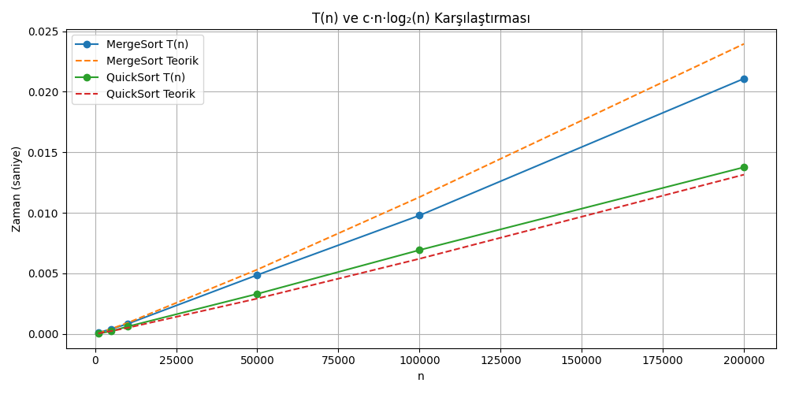
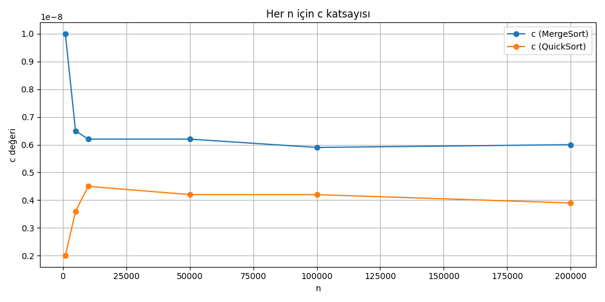
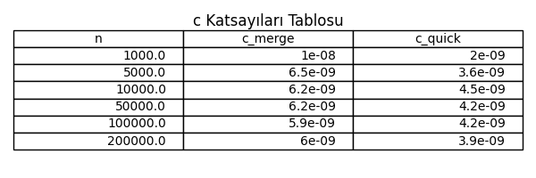

# 📊 CENG 204 - Algoritmalar Ödevi #2

Bu projede, Merge Sort ve Quick Sort algoritmalarının farklı dizi boyutlarında çalışma süreleri analiz edilmiştir. Amaç, teorik zaman karmaşıklığı ile deneysel sonuçları karşılaştırmak ve her algoritma için `c` katsayısını hesaplamaktır.

## 🧠 Amaç

- Merge Sort ve Quick Sort algoritmalarını C dilinde uygulamak
- Farklı boyutlardaki rastgele diziler üzerinde algoritmaları test etmek
- Ortalama sıralama süresini (`T(n)`) hesaplamak
- `c = T(n) / (n · log₂(n))` formülüyle sabit katsayısını bulmak
- Sonuçları tablo ve grafiklerle raporlamak

## ⚙️ Kullanılan Dizi Boyutları

- 1000
- 5000
- 10.000
- 50.000
- 100.000
- 200.000

Her boyut için 50 farklı rastgele dizi oluşturulmuş ve sıralama sürelerinin ortalaması alınmıştır.

## 📈 Grafikler

